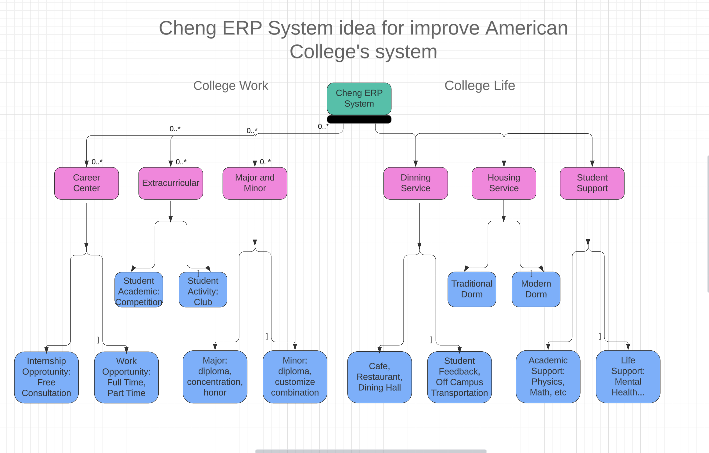

# ERP-System-Design-Luncy

- Cheng ERP System
    - College Work 
        - Career Center
            - Internship Opportunity
                - Schools should provide corresponding consultation service for students who are interested in gaining internship opportunity, and provide letter of recommendation service, etc.
                - Schools should provide some access to online job boards. 
            - Work Opportunity
                - Schools should provide some guidance to graduating students who are interested in pursuing full time or part time work opportunities
                - Schools should provide some access to online job boards
        - Extracurricular 
            - Student Academic: Competition
                - Schools should host academic competitions to promote importance of studying and friendly competition between students 
            - Student Activity: Club 
                - Schools should provide more funding for student clubs and encourage them to make good for society in real life
        - Major and Minor 
            - Major
                - Schools should keep information of major up-to-date, and allow students to choose a free combination of majors for two or three.
                - Schools should offer honor reward for students who perform excellent in relevant area of study both inside and outside of the classroom
            - Minor 
                - Schools should keep information of minor up-to-date, and allow students to choose a free combination of majors for two or three.
                - Schools should offer honor reward for students who perform excellent in relevant area of study both inside and outside of the classroom
    - College Life 
        - Dining Service 
            - Cafe, Restaurant, Dining Hall
                - Schools should provide diverse food for students with diverse backgrounds
                - Schools should make the enviornment more supportive
            - Off Campus Transportation
                - Schools should provide accessible transportation for students who want to go off campus and have food
                - Schools can also have collaboations with such restaurants on holiday or festivals as a way to celebrate life in college
        - Housing Service
            - Traditional Dorm
                - Traditional Dorm serves as the symbol of the school
                - Built with traditional styles: more fashioned paintings, etc.
            - Modern Dorm 
                - Modern Dorm serves as the evolution of the school
                - Built with modern styles: more accessible technology, etc.
        - Student Support 
            - Academic Support
                - Assist students who are struggling in coursework and need help with improving GPA
                - Design a better semester or year schedule with students to make sure good academic performance
            - Life Support 
                - Provide service to mental health and therapist consultation for students who are experiencing too much pressure in college
                - Provide emergency medical service to handle urgent cases for students who need emergency care 

## Ideas of achieving this goal
- Career Center
    - Free consultation service with appointment 
    - Online job platforms for registered students 
    - Job fair events (virtual or in-person)
- Extracurricular 
    - Club fundraising help service 
    - Oppoturnity to connect with local institutions
    - School host activity for student club performance 
- Major and Minor
    - Major and Minor consultation service 
    - Past schedule and curriculum reference in library 
    - Student-help-student platform online 
- Dining Service 
    - More diverse on-campus service with diverse types of food 
    - Collaboration with other local restaurants 
    - Student-host food sharing events 
- Housing Service 
    - Online housing selection portal with viewing and comparing 
    - Feedback collection from student groups
    - Connect with local grocery to purchase furniture easily 
- Life Support 
    - Anonymous surveys for students and gifts in return 
    - Consitently update policies to make students more comfortable
    - Online 1 to 1 help platform with faculty 
